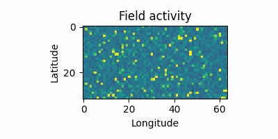

# `vbjax`

`vbjax` is a Jax-based package for working with virtual brain style models.

## Installation

Installs with `pip install vbjax`, but you can use the source,
```bash
git clone https://github.com/ins-amu/vbjax
cd vbjax
pip install .[dev]
```
The primary additional dependency of vbjax is
[JAX](github.com/google/jax), which itself depends only on
NumPy, SciPy & opt-einsum, so it should be safe to add to your
existing projects.

If you have a CUDA-enabled GPU, you install the requisite dependencies like so
```bash
pip install --upgrade "jax[cuda11_pip]" -f https://storage.googleapis.com/jax-releases/jax_cuda_releases.html
```

*BUT* because GPU software stack versions make aligning stars look like child's play,
container images are available and auto-built w/
[GitHub Actions](.github/workflows/docker-image.yml), so you can use w/ Docker
```bash
docker run --rm -it ghcr.io/ins-amu/vbjax:main python3 -c 'import vbjax; print(vbjax.__version__)'
```
The images are built on Nvidia runtime images, so `--gpus all` is enough
for Jax to discover the GPU(s).

## Examples

Here's an all-to-all connected network with Montbrio-Pazo-Roxin
mass model dynamics,

```python
import vbjax as vb
import jax.numpy as np

def network(x, p):
    c = 0.03*x.sum(axis=1)
    return vb.mpr_dfun(x, c, p)

_, loop = vb.make_sde(dt=0.01, dfun=network, gfun=0.1)
zs = vb.randn(500, 2, 32)
xs = loop(zs[0], zs[1:], vb.mpr_default_theta)
vb.plot_states(xs, 'rV', jpg='example1', show=True)
```


While integrators and mass models tend to be the same across publications, but
the network model itself varies (regions vs surface, stimulus etc), vbjax allows
user to focus on defining the `network` and then getting time series.  Because
the work is done by Jax, this is all auto-differentiable, GPU-able so friendly to
use with common machine learning algorithms.

### Neural field

Here's a neural field,
```python
import jax.numpy as np
import vbjax as vb

# setup local connectivity
lmax, nlat, nlon = 16, 32, 64
lc = vb.make_shtdiff(lmax=lmax, nlat=nlat, nlon=nlon)

# network dynamics
def net(x, p):
    c = lc(x[0]), 0.0
    return vb.mpr_dfun(x, c, p)

# solution + plot
x0 = vb.randn(2, nlat, nlon)*0.5 + np.r_[0.2,-2.0][:,None,None]
_, loop = vb.make_sde(0.1, net, 0.2)
zs = vb.randn(500, 2, nlat, nlon)
xt = loop(x0, zs, vb.mpr_default_theta._replace(eta=-3.9, cr=5.0))
vb.make_field_gif(xt[::10], 'example2.gif')

```


This example shows how the field forms patterns gradually despite the
noise in the simulation.

### Fitting an autoregressive process

Here's a 1-lag MVAR
```python
import jax
import jax.numpy as np
import vbjax as vb

nn = 8
true_A = vb.randn(nn,nn)
_, loop = vb.make_sde(1, lambda x,A: -x+(A*x).mean(axis=1), 1)
x0 = vb.randn(nn)
zs = vb.randn(1000, nn)
xt = loop(x0, zs, true_A)
```
`xt` and `true_A` are the simulated time series and ground truth
interaction matrices. 

To fit anything we need a loss function & gradient descent,
```python

def loss(est_A):
    return np.sum(np.square(xt - loop(x0, zs, est_A)))

grad_loss = jax.grad(loss)
est_A = np.ones((nn, nn))*0.3  # wrong
for i in range(51):
    est_A = est_A - 0.01*grad_loss(est_A)
    if i % 10 == 0:
        print('step', i, 'log loss', np.log(loss(est_A)))

print('mean sq err', np.square(est_A - true_A).mean())
```
which prints
```
step 0 log loss 5.8016257
step 10 log loss 3.687574
step 20 log loss 1.7174681
step 30 log loss -0.15798996
step 40 log loss -1.9851608
step 50 log loss -3.7805486
mean sq err 8.422789e-05
```
This is a pretty simple example but it's meant to show that any model
you build with vbjax like this is usable with optimization or NumPyro's
MCMC algorithms.

## HPC usage

We use this on HPC systems, most easily with container images.

<details><summary>CSCS Piz Daint</summary>

Useful modules
```bash
module load daint-gpu
module load cudatoolkit/11.2.0_3.39-2.1__gf93aa1c
module load TensorFlow
```
then install in some Python environment; the default works fine
```bash
pip3 install "jax[cuda]==0.3.8" -f https://storage.googleapis.com/jax-releases/jax_cuda_releases.html
pip3 install "jaxlib==0.3.8+cuda11.cudnn805" -U -f https://storage.googleapis.com/jax-releases/jax_cuda_releases.html
```
This provides an older version of JAX unfortunately. 

The Sarus runtime can be used to make use of latest versions of vbjax and jax:
```bash
$ module load daint-gpu
$ module load sarus
$ sarus pull ghcr.io/ins-amu/vbjax:main
...
$ srun -p debug -A ich042 -C gpu --pty sarus run ghcr.io/ins-amu/vbjax:main python3 -c 'import jax; print(jax.numpy.zeros(32).device())'
...
gpu:0
```
</details>

<details><summary>JSC JUSUF</summary>

A nice module is available to get CUDA libs
```bash
module load cuDNN/8.6.0.163-CUDA-11.7
```
then you might set up a conda env,
```bash
wget https://repo.anaconda.com/miniconda/Miniconda3-latest-Linux-x86_64.sh
bash Miniconda3-latest-Linux-x86_64.sh -b -p ~/conda
. ~/conda/bin/activate
conda create -n jax python=3.9 numpy scipy
source activate jax
```
once you have an env, install the CUDA-enabled JAX
```bash
pip3 install --upgrade "jax[cuda]" -f https://storage.googleapis.com/jax-releases/jax_cuda_releases.html
```
and check it works
```bash
(jax) [woodman1@jsfl02 ~]$ srun -A icei-hbp-2021-0002 -p develgpus --pty python3 -c 'import jax.numpy as np ; print(np.zeros(32).device())'
gpu:0
```
JSC also makes Singularity available, so the prebuilt image can be used
```
TODO
```
</details>

<details><summary>CEA</summary>

The prebuilt image is the best route:
```
TODO
```
</details>

## Development

New ideas or even documenting tricks (like how Jax works) should go
into the test suite, and there are some ideas floating there before
making it into the library itself.
```
git clone https://github.com/ins-amu/vbjax
cd vbjax
pip install '.[dev]'
pytest
```

### Installing SHTns

This library is used for some testing.  It is impossible to install on 
Windows natively, so WSLx is required.  

On macOS,
```bash
brew install fftw
git clone https://bitbucket.org/nschaeff/shtns
./configure --enable-python --disable-simd --prefix=/opt/homebrew
make -j && make install && python setup.py install
```

### Releases
a release of version `v1.2.3` requires following steps
- [ ] `git checkout main`: tag releases from main for now
- [ ] edit `_version.py` to have correct release number
- [ ] `python -m vbjax._version tag` to create and push new tag
  - [GitHub tests, builds and pushes tag release to PyPI](.github/workflows/publish-tags.yml)
- [ ] use GitHub UI to create new release
