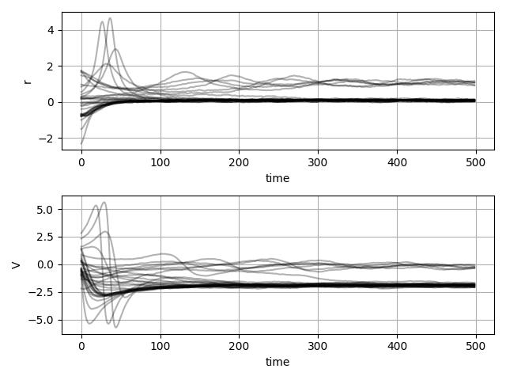

# `vbjax`

`vbjax` is a Jax-based package for working with virtual brain style models.

## Installation

Installs with `pip install vbjax`, but you use the source,
```bash
git clone https://github.com/ins-amu/vbjax
cd vbjax
pip install .[dev]
```
The primary additional dependency of vbjax is
[JAX](github.com/google/jax), which itself depends only on
NumPy, SciPy & opt-einsum, so it should be safe to add to your
existing projects.

Container images are available and auto-built w/
[GitHub Actions](.github/workflows/docker-image.yml), so you can use w/ Docker
```bash
docker run --rm -it ghcr.io/ins-amu/vbjax:main python3 -c 'import vbjax; print(vbjax.__version__)'
```
The images are built on Nvidia runtime images, so `--gpus all` is enough
for Jax to discover the GPU(s).

## Examples

Here's an all-to-all connected network with Montbrio-Pazo-Roxin
mass model dynamics,

```python
import vbjax as vb
import jax.numpy as np

def network(x, p):
    c = 0.03*x.sum(axis=1)
    return vb.mpr_dfun(x, c, p)

_, loop = vb.make_sde(dt=0.01, dfun=network, gfun=0.1)
zs = vb.randn(500, 2, 32)
xs = loop(zs[0], zs[1:], vb.mpr_default_theta)
vb.plot_states(xs, 'rV', jpg='example1', show=True)
```


While integrators and mass models tend to be the same across publications, but
the network model itself varies (regions vs surface, stimulus etc), vbjax allows
user to focus on defining the `network` and then getting time series.  Because
the work is done by Jax, this is all auto-differentiable, GPU-able so friendly to
use with common machine learning algorithms.

Here's a neural field,
```python
import jax.numpy as np
import vbjax as vb

# setup local connectivity
lmax, nlat, nlon = 16, 32, 64
lc = vb.make_shtdiff(lmax=lmax, nlat=nlat, nlon=nlon)

# network dynamics
def net(x, p):
    c = lc(x[0]), 0.0
    return vb.mpr_dfun(x, c, p)

# solution + plot
x0 = vb.randn(2, nlat, nlon)*0.5 + np.r_[0.2,-2.0][:,None,None]
_, loop = vb.make_sde(0.1, net, 0.2)
zs = vb.randn(500, 2, nlat, nlon)
xt = loop(x0, zs, vb.mpr_default_theta._replace(eta=-3.9, cr=5.0))
vb.make_field_gif(xt[::10], 'example2.gif')

```


This example shows how the field forms patterns gradually despite the
noise in the simulation.

## Development
```
git clone https://github.com/ins-amu/vbjax
cd vbjax
pip install '.[dev]'
pytest
```

## Releases
a release of version `v1.2.3` requires following steps
- [ ] `git checkout main`: tag releases from main for now
- [ ] edit `_version.py` to have correct release number
- [ ] `python -m vbjax._version tag` to create and push new tag
  - [GitHub tests, builds and pushes tag release to PyPI](.github/workflows/publish-tags.yml)
- [ ] use GitHub UI to create new release
